<h1 align="center">Hi, I'm Vinarm Jawa 👋</h1>

<h3 align="center">
  Software Engineer • MERN Stack • Backend • AI Systems
</h3>

  
  &nbsp;
  
  &nbsp;
  

---

## 👨‍💻 About Me

I'm a **Software Engineer** focused on building full-stack applications, scalable backend systems, and AI-powered products.

- 🔭 Currently working on **Full-Stack Applications**
- 🤖 Building **AI Systems, Agents & RAG Applications**
- 🧩 Interested in **Backend Architecture & Scalable Systems**
- 🤝 Open to collaborating on **Open Source & Full-Stack Projects**
- 💬 Ask me about **React, Node.js, REST APIs, MongoDB & DSA**

---

## 🛠️ Tech Stack

### 💻 Languages

### 🎨 Frontend

### ⚙️ Backend & APIs

### 🗄️ Databases

### ☁️ Cloud & Tools

---

## 📊 GitHub Stats

  

  

  

---

  <b>Building software that solves real-world problems.</b>

